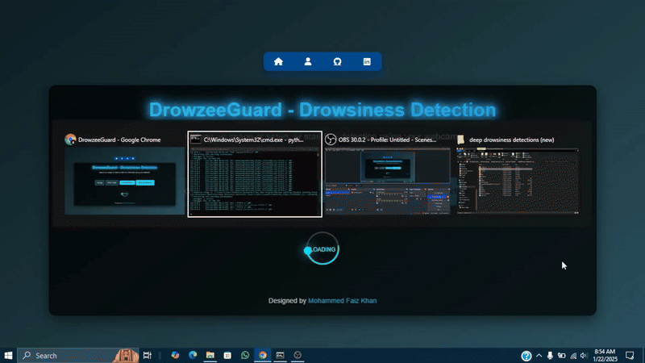

# DrowzeeGuard  

**DrowzeeGuard** is a lightweight drowsiness detection application designed to help prevent accidents by detecting if a person appears drowsy or awake. The app supports image and video uploads, live detections (GPU recommended), and even bulk dataset processing. It’s built with Flask to keep things simple and effective.  

## Demo  

### Image/Video Detection  
  

### Live Detection  
  

## Features  
- Upload images, videos, or entire folders for quick detection.  
- Live detection using a webcam (requires GPU for best performance).  
- ZIP download of bulk detection results.  
- Built with YOLOv5 for accurate and fast detection.  

## Folder Structure  

- **app.py**: Main Flask app where all detection logic is implemented.
- **Proper_Drowsiness_Detection_using_YOLOv11.ipynb**: Contains the entire step how i fine tuned the YOLO11 model on custom dataset
- **best.py**: Fine-tuned YOLOv11 model for gesture detection.
- **collect_images.py**: Script for collecting images to create a custom dataset.
- **web_cam_detection.py**: A test script for live gesture detection using the fine-tuned model.
- **templates/**: Contains all the HTML files for the web application design.
- **static/**: Holds the CSS files, uploaded files, and detected output files.
- **runs/**: YOLOv11 folder containing the detected output files.

## How to Run

1. Clone this repository:
   ```bash
   git clone https://github.com/yourusername/your-repo-name.git
   cd your-repo-name
   ```

2. Install dependencies:
   ```bash
    pip install -r requirements.txt
   ```

3. Start the application::
   ```bash
    python app.py
   ```

## Educational Note
Curious about how to integrate a computer vision model into a Flask web application? This project demonstrates a simple yet effective way to do it.

